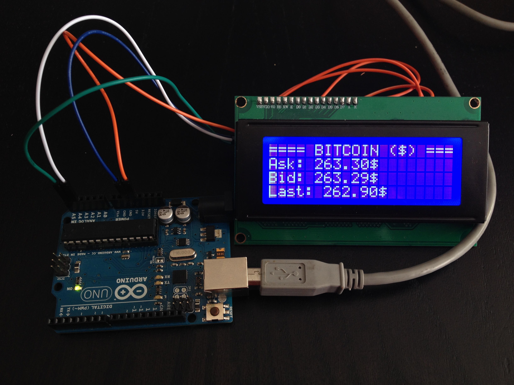
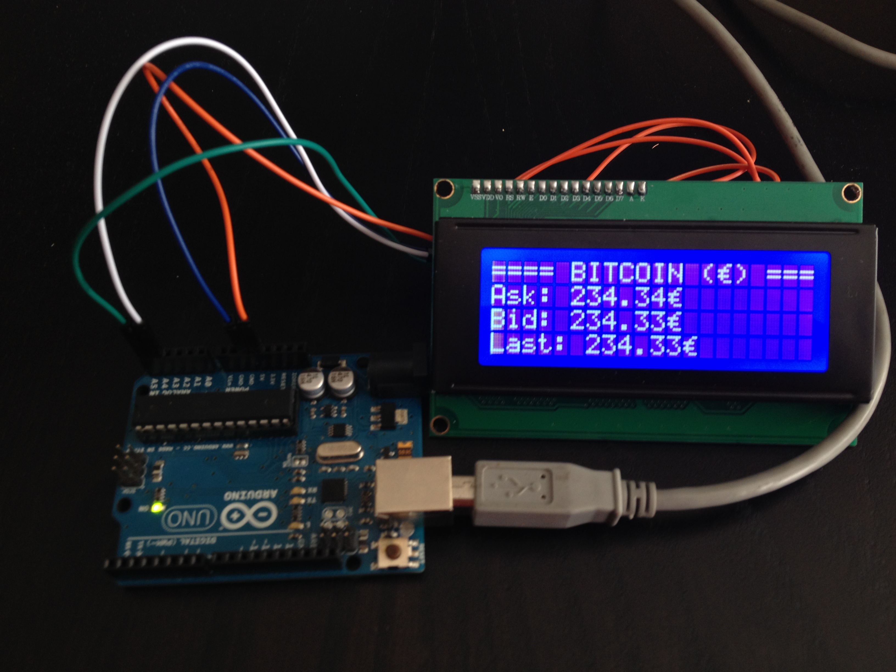

# Bitcoin-price-ticker-with-Arduino
Este script nos permite ver en la pantalla LCD, el valor en Dolares o Euros de un Bitcon en tiempo real. 

## Descripción:

Los datos son importados desde [firebase](https://publicdata-bitcoin.firebaseio.com/), puedes ver los datos cambiando en tiempo real.

[Más info...](https://www.firebase.com/blog/2013-10-25-btcquote-bitcoin-price-ticker.html) 

La elección de la moneda se hace a través de la variable *currency*

~~~
var currency = "dollar"; // "dollar" or "euro"
~~~

- **Dolares**

- **Euros**

Los Euros se calculan partiendo de los dolares, en primer lugar se multiplican por el valor de conversión definido en *euroRate*.

~~~
var euroRate = 0.89;
~~~ 

Nota: es necesario actualizar este valor, si hay un cambio significativo.

## Hardware necesario:
- Placa Arduino UNO o similar [x1]
- LCD 20x4 I2C [x1]

*Nota: el código puede adaptarse a una pantalla LCD sin I2C o con menos lineas, más info en [Johnny-five API](http://johnny-five.io/api/lcd/)*

## Extra: 
- Modo Debug. Imprime información por consola. Solo es necesario actualizar el valor de la varaible *debugMode* a *true*

~~~
var debugMode = true;
~~~

## Instalación:

Es necesario contar con [Nodejs](https://nodejs.org/) y [Npm](https://docs.npmjs.com/getting-started/installing-node) en tu sistema.

Para este script es necesario instalar Johnny-Five:

~~~
sudo npm install -g johnny-five
~~~

y Firebase:

~~~
sudo npm install -g firebase
~~~

## Ejecutar el Script:

Desde la carpeta donde esta *bitcoins.js*

~~~
node bitcoins
~~~
